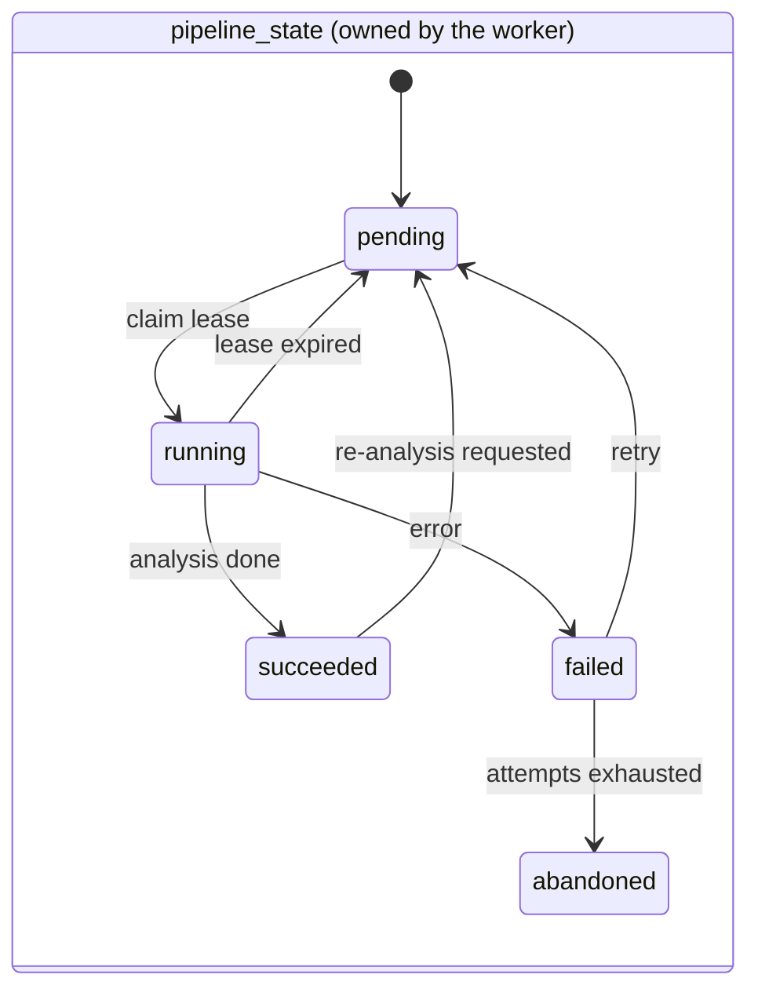
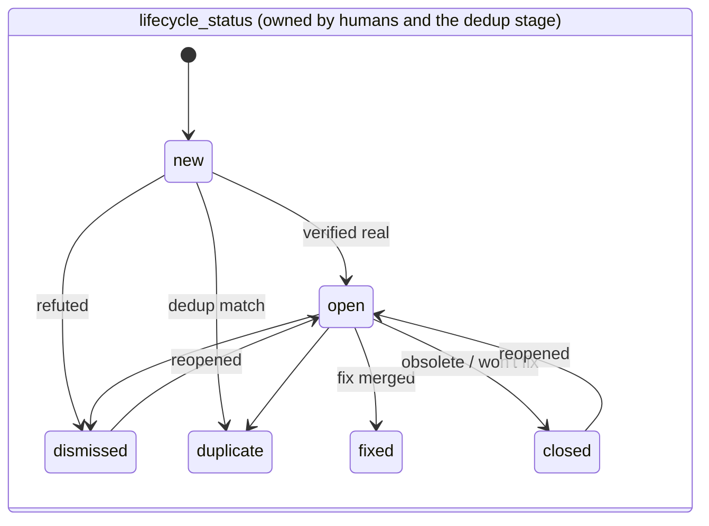
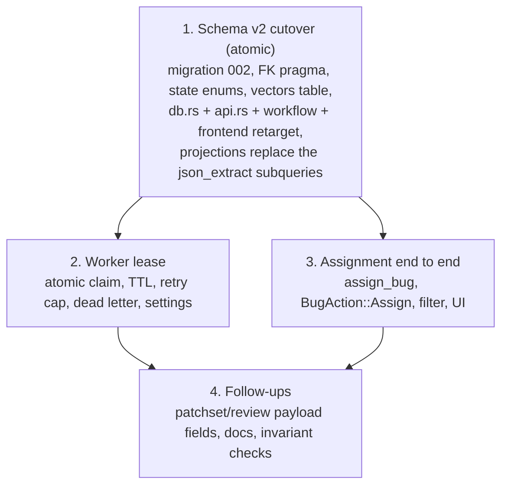

# Design: Linux Bug Workflow Schema v2

## Status
Proposed

## 1. Motivation

The Linux bug schema introduced in migrations 002-004 got the hard part right: splitting
immutable defect identity (`bugs`) from an append-only, typed enrichment log
(`bug_enrichments`). That split is retained unchanged in spirit here.

What it got wrong is everything surrounding that split. A schema review surfaced eight
defects, ranging from a latent data-loss bug to a table-naming scheme that blocks adding a
second workflow. This document specifies the corrected schema, the Rust type-driven state
that backs it, and a workflow-scoped naming convention.

### 1.1 Defects being fixed

| # | Defect | Consequence |
| --- | --- | --- |
| D1 | Single free-form `status` column conflates three axes | Crash during re-analysis silently reverts a human-triaged bug to an unprocessed candidate |
| D2 | No assignment concept anywhere | Cannot record who is working on a bug |
| D3 | `lock_raw_bug` is a non-atomic SELECT-then-UPDATE | Two workers can claim the same bug; no lease, no retry cap, no dead letter |
| D4 | Severity and other facts live only inside enrichment JSON | Per-row `json_extract` correlated subqueries, and a per-row recursive CTE, on every list query |
| D5 | `vector_json` blob sits on the hot core row | Dragged along by wide reads; embeddings cannot be versioned |
| D6 | Missing integrity constraints; **`PRAGMA foreign_keys` is never enabled** | Duplicate cycles are representable; every `ON DELETE CASCADE` in the schema is decorative and has never fired |
| D7 | `audit_*` attribution side-channel is mutable, nullable state | A writer that forgets to set it attributes the change to whoever last touched the row |
| D8 | `status` and `kind` are stringly-typed, no `CHECK`, no Rust enum | Typos insert cleanly and become permanently unreachable; violates the type-driven-state rule in `GEMINI.md` |

D1 is worth spelling out because it is an active bug, not a stylistic complaint:

> `lock_raw_bug` sets `status = 'processing'`, overwriting `open`. If the process crashes,
> `recover_stale_processing_bugs` blanket-resets **every** `processing` row to `'raw'`. A
> bug that a human had triaged, commented on, and marked `open` becomes an unprocessed
> candidate again, and the default list view (`status = 'open'`) stops showing it.

Evidence that the axes are genuinely tangled: the worker writes `status = "failed"`
([bug_worker.rs:94](file:///usr/local/google/home/kfree/sashiko/src/worker/bug_worker.rs#L94))
— a *pipeline execution outcome* — into the same column that holds *triage decisions*.

### 1.2 Non-goals

- No RBAC, no user records, no authentication changes. Per explicit decision, assignment is
  a plain email string and **no persistent user data is stored**.
- No change to the enrichment taxonomy or to any prompt/stage logic.
- No change to the patch-review tables (`patchsets`, `patches`, `reviews`, `findings`).
  They keep their current names; only the bug workflow is renamed in this pass.

---

## 2. Table naming convention

To make room for future workflows, every table owned by a workflow carries that workflow's
name as a prefix. The core entity table is the pluralised workflow name; children are
prefixed with the singular workflow name.

| Old | New |
| --- | --- |
| `bugs` | `bugs` |
| `bug_enrichments` | `bug_enrichments` |
| `bugs_subsystems` | `bug_subsystems` |
| `review_bugs` | `bug_reviews` |
| *(new)* | `bug_vectors` |

Shared, workflow-agnostic tables (`people`, `subsystems`, `mailing_lists`, `messages`,
`threads`) stay unprefixed — they are infrastructure, not workflow state. A future
`syzbot_*` or `cve_*` workflow adds its own prefixed tables and reuses the shared ones.

> [!NOTE]
> Indexes and triggers follow the same rule: `idx_bugs_*`, `trg_bugs_*`,
> `trg_bug_enrichments_*`.

---

## 3. State model

The single `status` column splits into two orthogonal, independently-owned columns.





The critical property: **the worker only ever writes `pipeline_state`, and re-analysis
therefore cannot destroy triage state.** Crash recovery expires leases, which touches
`pipeline_state` alone.

### 3.1 Value mapping from v1

| v1 `status` | v2 `lifecycle_status` | v2 `pipeline_state` |
| --- | --- | --- |
| `raw` | `new` | `pending` |
| `processing` | *(unchanged)* | `running` |
| `open` | `open` | `succeeded` |
| `dismissed` | `dismissed` | `succeeded` |
| `closed` | `closed` | *(unchanged)* |
| `duplicate` | `duplicate` | `succeeded` |
| `failed` | *(unchanged)* | `failed` |
| `fixed` | `fixed` | *(unchanged)* |

Since we are doing a clean break (§6), this table describes semantics for the reader and for
updating call sites, not a data backfill.

---

## 4. Schema

### 4.1 `bugs`

```sql
CREATE TABLE IF NOT EXISTS bugs (
    id INTEGER PRIMARY KEY AUTOINCREMENT,
    bugid TEXT NOT NULL UNIQUE,
    title TEXT NOT NULL,

    -- Triage lifecycle. Written by humans, the API, and the deduplication stage.
    lifecycle_status TEXT NOT NULL DEFAULT 'new'
        CHECK (lifecycle_status IN
            ('new','open','fixed','dismissed','duplicate','closed')),

    -- Analysis execution state. Written exclusively by the bug worker.
    pipeline_state TEXT NOT NULL DEFAULT 'pending'
        CHECK (pipeline_state IN
            ('pending','running','succeeded','failed','abandoned')),

    reporter TEXT NOT NULL,
    reported_at INTEGER NOT NULL,

    -- Assignment. Plain email by design: no persistent user records exist.
    assignee TEXT,
    assigned_at INTEGER,

    -- Immutable discovery provenance.
    discovered_in_patchset_id INTEGER,
    discovered_in_patch_id INTEGER,
    discovered_in_commit TEXT,
    source_ref TEXT,

    duplicate_of_id INTEGER,

    -- Worker lease (see section 5).
    locked_by TEXT,
    lease_expires_at INTEGER,
    attempt_count INTEGER NOT NULL DEFAULT 0,
    last_error TEXT,

    -- Projections maintained by trigger from enrichments (see section 7).
    severity_int INTEGER NOT NULL DEFAULT 0 CHECK (severity_int BETWEEN 0 AND 4),
    verified_on_sha TEXT,
    introducing_commit_sha TEXT,
    fixed_in_commit_sha TEXT,

    -- Attribution side channel consumed by the audit triggers.
    -- NOT NULL DEFAULT so that a writer which forgets to set it degrades to
    -- 'system' rather than silently inheriting the previous actor.
    audit_author TEXT NOT NULL DEFAULT 'system',
    audit_tool   TEXT NOT NULL DEFAULT 'system',
    audit_model  TEXT,

    created_at INTEGER NOT NULL,
    updated_at INTEGER NOT NULL,

    CHECK (duplicate_of_id IS NULL OR duplicate_of_id != id),
    CHECK ((lifecycle_status = 'duplicate') = (duplicate_of_id IS NOT NULL)),
    CHECK (assignee IS NULL OR length(trim(assignee)) > 0),

    FOREIGN KEY(discovered_in_patchset_id) REFERENCES patchsets(id) ON DELETE SET NULL,
    FOREIGN KEY(discovered_in_patch_id)    REFERENCES patches(id)   ON DELETE SET NULL,
    FOREIGN KEY(duplicate_of_id)           REFERENCES bugs(id) ON DELETE RESTRICT
);
```

Index set, chosen to match the actual query shapes in `list_bugs`:

```sql
CREATE INDEX IF NOT EXISTS idx_bugs_lifecycle   ON bugs(lifecycle_status, created_at DESC);
CREATE INDEX IF NOT EXISTS idx_bugs_pipeline    ON bugs(pipeline_state, created_at);
CREATE INDEX IF NOT EXISTS idx_bugs_assignee    ON bugs(assignee, lifecycle_status);
CREATE INDEX IF NOT EXISTS idx_bugs_severity    ON bugs(severity_int DESC, id DESC);
CREATE INDEX IF NOT EXISTS idx_bugs_reporter    ON bugs(reporter);
CREATE INDEX IF NOT EXISTS idx_bugs_reported_at ON bugs(reported_at);
CREATE INDEX IF NOT EXISTS idx_bugs_duplicate   ON bugs(duplicate_of_id);
CREATE INDEX IF NOT EXISTS idx_bugs_lease       ON bugs(pipeline_state, lease_expires_at);
```

> [!IMPORTANT]
> `CHECK ((lifecycle_status = 'duplicate') = (duplicate_of_id IS NOT NULL))` makes the two
> fields inseparable — `mark_bug_as_duplicate` must set both in a single `UPDATE`. This is
> deliberate: it makes the "status says duplicate but nothing is linked" state
> unrepresentable. It is also why `duplicate_of_id` uses `ON DELETE RESTRICT` rather than
> `SET NULL`, since a cascade to NULL would violate the CHECK.

### 4.2 `bug_enrichments`

Structurally unchanged from v1 apart from the rename and the FK retarget. The open `kind`
vocabulary is intentional and preserved; it is constrained in Rust (§8), not in SQL, because
the whole point of the enrichment log is that new kinds need no migration.

```sql
CREATE TABLE IF NOT EXISTS bug_enrichments (
    id INTEGER PRIMARY KEY AUTOINCREMENT,
    bug_id INTEGER NOT NULL,
    kind TEXT NOT NULL,
    tool TEXT NOT NULL,
    model TEXT,
    author TEXT,
    created_at INTEGER NOT NULL,
    content TEXT,
    data_json TEXT,
    tokens_in INTEGER,
    tokens_out INTEGER,
    tokens_cached INTEGER,
    logs TEXT,
    FOREIGN KEY(bug_id) REFERENCES bugs(id) ON DELETE CASCADE
);

CREATE INDEX IF NOT EXISTS idx_bug_enrichments_bug  ON bug_enrichments(bug_id, created_at, id);
CREATE INDEX IF NOT EXISTS idx_bug_enrichments_kind ON bug_enrichments(kind, bug_id);
CREATE INDEX IF NOT EXISTS idx_bug_enrichments_tool ON bug_enrichments(tool);
```

The `(bug_id, created_at, id)` index now covers the `ORDER BY created_at, id` used by the
enrichment loader, which previously sorted on a non-covering index.

### 4.3 `bug_vectors`

Moves the embedding blob off the hot row (D5) and makes embeddings versionable by model.

```sql
CREATE TABLE IF NOT EXISTS bug_vectors (
    bug_id INTEGER NOT NULL,
    model TEXT NOT NULL DEFAULT '',
    vector_json TEXT NOT NULL,
    created_at INTEGER NOT NULL,
    PRIMARY KEY (bug_id, model),
    FOREIGN KEY(bug_id) REFERENCES bugs(id) ON DELETE CASCADE
);
```

Keying on `(bug_id, model)` means re-embedding with a new model adds a row instead of
destroying the old vector, so a model swap no longer invalidates dedup history.

### 4.4 `bug_subsystems` and `bug_reviews`

```sql
CREATE TABLE IF NOT EXISTS bug_subsystems (
    bug_id INTEGER NOT NULL,
    subsystem TEXT NOT NULL,
    PRIMARY KEY (bug_id, subsystem),
    FOREIGN KEY(bug_id) REFERENCES bugs(id) ON DELETE CASCADE
);

CREATE TABLE IF NOT EXISTS bug_reviews (
    review_id INTEGER NOT NULL,
    bug_id INTEGER NOT NULL,
    is_newly_discovered INTEGER NOT NULL DEFAULT 1,
    PRIMARY KEY (review_id, bug_id),
    FOREIGN KEY(review_id) REFERENCES reviews(id)   ON DELETE CASCADE,
    FOREIGN KEY(bug_id)    REFERENCES bugs(id) ON DELETE CASCADE
);
```

`bug_reviews` gains `ON DELETE CASCADE` on both sides, fixing the v1 inconsistency
where enrichments cascaded but junction rows did not.

### 4.5 Enabling foreign keys

> [!CAUTION]
> `PRAGMA foreign_keys` is never set today, so SQLite defaults it to OFF and **no foreign key
> in this database has ever been enforced**. Every `ON DELETE CASCADE` written in migrations
> 001 and 002 is decorative. Enabling enforcement is required for the constraints above to
> mean anything, but it changes behaviour for the pre-existing tables too.

`PRAGMA foreign_keys = ON` will be added to connection setup alongside the existing
`journal_mode=WAL` and `busy_timeout` pragmas. The pragma is per-connection, not persisted.

Risk: pre-existing orphan rows in the older tables would begin to cause errors on write.
Mitigation: `make check-db-invariants` gains an orphan scan across all FK relationships, run
before the pragma is switched on, and the integration suite exercises the full ingest path.
If orphans are found in the older tables, the pragma flip moves to its own follow-up commit
so the bug-schema work is not blocked.

---

## 5. Worker lease protocol

Replaces the non-atomic claim and the blanket recovery reset (D3).

Claim, following the `lock_pending_email` precedent already in `db.rs` (single statement,
`UPDATE ... WHERE id = (SELECT ...) RETURNING`, which is atomic under SQLite's write lock):

```sql
UPDATE bugs
   SET pipeline_state  = 'running',
       locked_by       = ?1,          -- worker identity
       lease_expires_at = ?2,         -- now + lease_ttl
       attempt_count   = attempt_count + 1,
       updated_at      = ?3,
       audit_author    = 'system',
       audit_tool      = 'sashiko:linux_bug'
 WHERE id = (
     SELECT id FROM bugs
      WHERE pipeline_state = 'pending'
         OR (pipeline_state = 'running' AND lease_expires_at < ?3)
      ORDER BY created_at ASC
      LIMIT 1
 )
RETURNING id;
```

Expired-lease rows are reclaimable by the same query, so recovery is continuous rather than
a startup-only sweep. `recover_stale_processing_bugs` is replaced by:

```sql
UPDATE bugs
   SET pipeline_state = 'pending', locked_by = NULL, lease_expires_at = NULL
 WHERE pipeline_state = 'running' AND lease_expires_at < ?;
```

Note this no longer touches `lifecycle_status` at all — the D1 data-loss bug is structurally
eliminated.

Failure handling gains a retry cap and a dead letter:

- Analysis error → `pipeline_state = 'failed'`, `last_error = <message>`, lease cleared.
- A `failed` row with `attempt_count >= max_attempts` → `pipeline_state = 'abandoned'` and
  it is never claimed again. Requeueing is an explicit operator action.
- `max_attempts` and `lease_ttl_seconds` become settings under a new `[linux_bug]` section
  in `Settings.toml`, defaulting to 3 and 1800.

The worker writes `last_error` and `pipeline_state` only; the `severity_explanation`
hijacking at [bug_worker.rs:94](file:///usr/local/google/home/kfree/sashiko/src/worker/bug_worker.rs#L94)
(which stuffs an error string into a severity field) goes away.

---

## 6. Migration strategy

Per decision, a **clean break**: no bug data is carried forward. The whole bug schema ships as
a single migration, `002_bugs.sql`, which creates the layout described in section 4
directly.

An earlier draft of this branch built the schema across four migrations, 002 through 005, with
005 dropping what the earlier three had created. That history is not worth preserving: the
branch merges and deploys atomically, and production has never held a bug table, so the
intermediate states existed only inside this branch. Collapsing them removes a drop-and-recreate
step that had to run outside a transaction, because SQLite refuses to toggle
`PRAGMA foreign_keys` inside one, and which could therefore leave a partially applied schema
behind on failure.

`Database::migrate` is consequently two arms: version 1 for the initial schema, version 2 for
the bug schema, both wrapped in a transaction.

---

## 7. Fact projection

Fixes D4. The enrichment log remains the source of truth; hot query fields are projected onto
`bugs` by trigger, so consistency does not depend on every writer remembering to
update them.

```sql
CREATE TRIGGER IF NOT EXISTS trg_bug_enrichments_project_severity
AFTER INSERT ON bug_enrichments
FOR EACH ROW WHEN new.kind = 'severity_calibration'
BEGIN
    UPDATE bugs SET severity_int = COALESCE(
        CAST(json_extract(new.data_json, '$.severity_int') AS INTEGER),
        CASE LOWER(json_extract(new.data_json, '$.severity'))
            WHEN 'critical' THEN 4
            WHEN 'high'     THEN 3
            WHEN 'medium'   THEN 2
            WHEN 'low'      THEN 1
            ELSE 0
        END,
        0)
    WHERE id = new.bug_id;
END;
```

Analogous triggers project `verified_on_sha` (from `verification`),
`introducing_commit_sha` (from `origin_discovery`), and `fixed_in_commit_sha` (from
`fix_candidate` where `$.commit_sha` is present). Latest-write-wins, which matches the
`ORDER BY created_at DESC LIMIT 1` semantics the current subqueries already implement.

These triggers do not touch audited columns, so they cannot cascade into the audit triggers.

Payoff, in `list_bugs`:

```sql
-- before: correlated subquery + json_extract, per row
ORDER BY COALESCE((SELECT CAST(json_extract(data_json,'$.severity_int') AS INTEGER)
                   FROM bug_enrichments WHERE bug_id = bugs.id
                   AND kind='severity_calibration' ORDER BY created_at DESC LIMIT 1), 0) DESC

-- after: indexed column
ORDER BY severity_int DESC, id DESC
```

The `discoveries` sort keeps its recursive CTE for now — duplicate-family counting is genuinely
recursive and is not a hot path. It is noted as future work rather than fixed here, to keep
this change reviewable.

---

## 8. Rust type-driven state

Fixes D8, and satisfies the `GEMINI.md` rule that invalid states be unrepresentable.

```rust
/// Triage lifecycle. Written by humans, the API, and the deduplication stage.
#[derive(Debug, Clone, Copy, PartialEq, Eq, Serialize, Deserialize, Default)]
#[serde(rename_all = "snake_case")]
pub enum BugLifecycleStatus {
    #[default]
    New,
    Open,
    Fixed,
    Dismissed,
    Duplicate,
    Closed,
}

/// Analysis execution state. Written exclusively by the bug worker.
#[derive(Debug, Clone, Copy, PartialEq, Eq, Serialize, Deserialize, Default)]
#[serde(rename_all = "snake_case")]
pub enum BugPipelineState {
    #[default]
    Pending,
    Running,
    Succeeded,
    Failed,
    Abandoned,
}
```

Both get `as_str()`, `Display`, and `FromStr` with a hard error on unknown input, mirroring
the existing `Severity` enum's shape so the codebase stays internally consistent. A DB row
carrying an unrecognised value is a corrupt-database error, not a silent fallback — the
`CHECK` constraints make it unreachable anyway.

`EnrichmentKind` is different: the open taxonomy is a feature, so it takes the escape hatch
the `GEMINI.md` prompt-engineering rules call for:

```rust
pub enum EnrichmentKind {
    Candidate, Verification, Deduplication, OriginDiscovery,
    SeverityCalibration, Report, Reproducer, FixCandidate,
    Comment, Link, Audit, Assignment,
    Other(String),
}
```

`Other(String)` round-trips unknown kinds unchanged, so a future tool can write a new kind
without a code change, while the known set gets compile-time checking. The v1 `raw_candidate`
/ `candidate` drift (which `Bug::locations()` currently works around by checking both)
normalises to `Candidate` on parse.

`Bug.status: String` becomes two typed fields; `Bug::is_fixed()` stops comparing magic
strings. The dead `status == "fixed"` branch is removed — nothing ever wrote that value.

---

## 9. Assignment

Fixes D2, as a plain email field per the no-persistent-user-data decision.

- `bugs.assignee TEXT` (nullable) + `assigned_at INTEGER`, indexed on
  `(assignee, lifecycle_status)` so "my open bugs" is a single indexed lookup.
- History recorded as `kind = 'audit'` enrichments by the same trigger mechanism as
  `lifecycle_status` and `title`, so the existing UI enrichment feed renders it for free.

```sql
CREATE TRIGGER IF NOT EXISTS trg_bugs_audit_assignee
AFTER UPDATE OF assignee ON bugs
FOR EACH ROW WHEN old.assignee IS NOT new.assignee
BEGIN
    INSERT INTO bug_enrichments
        (bug_id, kind, tool, author, model, created_at, content, data_json)
    VALUES (new.id, 'audit', new.audit_tool, new.audit_author, new.audit_model,
            strftime('%s','now'),
            CASE
                WHEN new.assignee IS NULL THEN 'Unassigned'
                ELSE 'Assigned to ' || new.assignee
            END,
            json_object('field','assignee','old',old.assignee,'new',new.assignee));
END;
```

All audit triggers use `old.x IS NOT new.x`, the null-safe operator, rather than the
three-clause `WHEN` boilerplate an earlier draft carried (D6).

API surface — one new variant on the existing `BugAction` enum, so it inherits the current
authorization path unchanged:

```rust
BugAction::Assign { assignee: Option<String> }   // None unassigns
```

`POST /api/bug/action` with `{"action": {"assign": {"assignee": "dev@example.com"}}}`.
Validation: non-empty, contains `@`, trimmed, length-capped. Self-assign is the common case
and needs no special handling — the caller passes their own email.

`GET /api/bugs` gains an `assignee=` filter (and `assignee=none` for unassigned).

---

## 10. Consequential changes

| Area | Change |
| --- | --- |
| `db.rs` queries | ~90 `bugs` references and 47 `bug_enrichments` references retargeted to the new table names |
| `db.rs` API | `lock_raw_bug` → `claim_next_bug`; `recover_stale_processing_bugs` → `expire_stale_bug_leases`; `update_bug_status` splits into `set_bug_lifecycle_status` / `set_bug_pipeline_state`; new `assign_bug`; `update_bug_vector` retargets to `bug_vectors` |
| `api.rs` | `BugListQuery.status` → `lifecycle_status` plus new `pipeline_state` and `assignee`; `BugSubsystemsQuery.status` likewise; `BugAction::Assign` added; the `bug.status == "duplicate"` branch at api.rs:1016 reads `lifecycle_status` |
| `workflows/linux_bug.rs` | Writes typed lifecycle/pipeline values instead of strings; test fixtures updated (including the bogus `status: "verified"` fixtures) |
| `worker/bug_worker.rs` | Uses the lease protocol; writes `last_error` instead of hijacking `severity_explanation` |
| `static/index.html` | `getBugStatus()` rewritten for two axes; status select split; assignee column, filter, and assign action |
| `Settings.toml` | New `[linux_bug]` section: `lease_ttl_seconds`, `max_attempts` |

Two findings from the frontend survey change the plan:

> [!NOTE]
> **`/api/bugs` has no server-side status default.** The "everything defaults to open"
> behaviour comes purely from the client (`index.html:1525`); only `/api/bugs/subsystems`
> defaults server-side (`api.rs:1834`). The split therefore cannot silently change list
> results for API clients.

> [!WARNING]
> **The patchset and review payloads never included `status`** (`db.rs:4644-4660` and
> `db.rs:5040-5053`), so the bug badge on the patchset detail card has always rendered
> "Open" regardless of the real status. This is a pre-existing bug. The new fields are added
> to both builders rather than reproducing the omission.

---

## 11. Implementation plan

A table rename combined with a column split cannot be decomposed into separately-green
commits — the schema and every reader have to move together. Step 1 is therefore
unavoidably large; the remaining steps are genuinely independent and stay small.
`make check-pr` runs before each commit, and every commit leaves the tree compiling with
tests passing.



Steps 2 and 3 are independent of each other and depend only on step 1, since migration 002
already creates the lease and assignee columns they need.

---

## 12. Open questions

1. **`fixed` vs `closed`.** Both exist in the v1 vocabulary and the distinction is currently
   unused — nothing ever writes `fixed`. Keep both (proposed: `fixed` = a merged fix exists,
   `closed` = resolved without a fix), or collapse to `closed` with a reason?
2. **FK pragma blast radius.** If orphans exist in the pre-existing tables, do we fix the data
   or defer the pragma to a follow-up? Proposed: scan first, decide on evidence.
3. **Abandoned-bug visibility.** Should `abandoned` bugs surface in the default list view with
   a warning badge, or stay hidden behind an explicit filter? Proposed: hidden by default,
   surfaced in an operator view, since they are an operational concern rather than a triage one.
