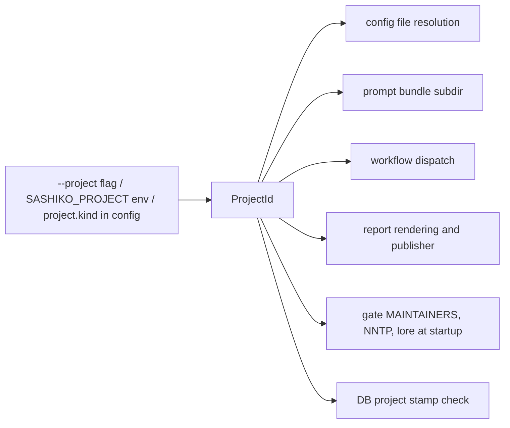
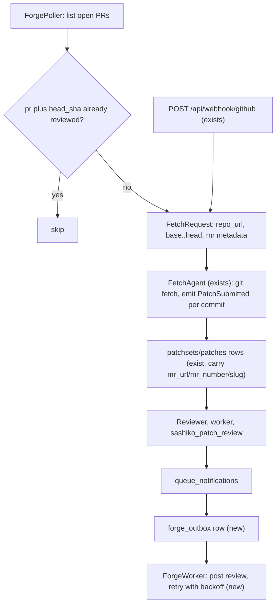

# Design: Multi-Project Review (Sashiko Reviewing Sashiko)

## 1. Overview

Sashiko today is a Linux kernel review system with a generic engine inside it.
The engine (`src/workflow/`) is already fully project-agnostic; everything that
knows about the kernel lives in three places: the workflow definition
(`src/workflows/linux_patch_review.rs`), the prompt tree
(`third_party/prompts/kernel`), and the ingestion/delivery edges (lore, NNTP,
patchwork, MAINTAINERS, SMTP).

This document specifies how to make the *project* an explicit, typed dimension
of the system, and how to stand up the first non-kernel project: Sashiko
reviewing its own changes, eventually as a GitHub bot that reviews open pull
requests and posts findings.

### 1.1 Goals

1. A first-class, type-driven `ProjectId` selected by `--project <linux|sashiko>`.
2. An independent Sashiko review workflow, free to diverge from the kernel one
   in stage set *and* graph shape.
3. A first-party `prompts/sashiko/` tree documenting Sashiko's own invariants.
4. Each project runs as a **separate instance** (own config file, DB, port,
   worktree dir) — no multi-tenancy, no cross-project queries.
5. A delivery seam so findings can go to a GitHub PR instead of an LKML reply.
6. No behavioural change whatsoever for the existing Linux deployment.

### 1.2 Non-goals (explicitly deferred)

- Multi-tenancy: one process serving several projects at once.
- A Sashiko equivalent of the `linux_bug` pre-existing-bug pipeline.
- Data-driven (TOML/YAML) workflow definitions. Stages stay in Rust.
- GitLab merge-request posting (the design keeps it reachable; GitHub first).

---

## 2. Current State (verified)

| Concern | Today | Parameterizable? |
|---|---|---|
| Workflow engine `src/workflow/` | Generic over state `S`, no domain knowledge | Yes, already |
| Review workflow | `build_linux_patch_review_workflow_with_options()` called directly at `worker/prompts.rs:353` | No registry, static call |
| Prompt root | `build.rs` `include_bytes!`-embeds `third_party/prompts/**`; extracted to `$XDG_DATA_HOME/sashiko/prompts/<REV>/`; `default_kernel_prompts_path()` = `.../kernel` | CLI `--prompts` only, no config key |
| Bundle contents | Already ships `kernel/`, `systemd/`, `iproute/`; only `kernel` reachable from code | — |
| `[project]` settings | `name`/`description`/`domain`/`attribution` — **branding only**, zero behaviour | — |
| Git tree / worktrees | `settings.git.repository_path`, `settings.review.worktree_dir` | Config + some CLI flags |
| DB | One file, **no project/tenant column, no metadata table** | Config `database.url` |
| Ingestion | lore manifest + NNTP hardcoded (`ingestor.rs:225,245,257`); `archives/<group>` literal; MAINTAINERS singleton loaded at startup | Partially |
| Forge | `src/forge.rs` parses + verifies webhooks only. `ForgeProvider` has 3 methods, none for output. No GitHub API client anywhere (no octocrab; `rg 'api.github.com'` → 0 hits) | — |
| Delivery | Hardcoded into `Reviewer::queue_notifications` (`reviewer.rs:2209-2562`) → `email_outbox` + `patchwork_outbox` | No publisher trait |
| Report artifact | LLM emits an LKML plaintext reply; `validate_inline_format` *requires* `>` quoting and a `commit <hash>` header | Per-workflow |

> [!NOTE]
> `linux_bug.rs` does **not** use the declarative framework — it hand-rolls
> `LlmSession` + `SessionRunner`. It stays untouched and Linux-only.

---

## 3. Architecture

### 3.1 Independent workflows behind a typed dispatch

**Decision: fork.** `src/workflows/sashiko_patch_review.rs` is a genuinely
independent workflow with its own state type, its own stage tables and its own
graph shape. `linux_patch_review.rs` is not refactored and not touched.

```
src/project.rs                ProjectId (new)
src/workflows/
  mod.rs                      review dispatch on ProjectId (new)
  linux_patch_review.rs       unchanged
  linux_bug.rs                unchanged
  sashiko_patch_review.rs     new, independent
  guard.rs                    two shared leaf helpers (see below)
```

`ProjectId` sits at the top level rather than under `workflows` because it is
not only a workflow selector: `settings`, `prompt_bundle` and startup all need
it, and `settings` must not depend on `workflows`.

The cost of forking is duplication; the mitigation is to bound it to prose and
graph structure, and to *not* duplicate the two pure functions whose
duplication would be a security hazard rather than a maintenance one:

- `sanitize_guide_name()` — the pre-screen reducer's rejection of guide names
  containing `/`, `\` or `..` (`linux_patch_review.rs:470-486`). This is the
  barrier between a patch from an untrusted source and arbitrary file inlining
  into the system prompt. A silent divergence here is a vulnerability.
- `normalize_stage_name()` — the `--stages` / planner-output normalizer.

Both move to `src/workflows/guard.rs` and are called from both workflows. Nothing
else is shared: state structs, stage tables, instructions, validators, the JSON
schema example and the graph are each written once per project.

> [!WARNING]
> Forking means a fix to the concern JSON contract, the recitation policy or the
> series-context wiring must be applied twice. Each file gets a header comment
> naming its sibling so the second application is not forgotten, and §6's
> benchmark suite is what catches a divergence that matters.

#### The dispatch point

`worker/prompts.rs:353` currently calls
`build_linux_patch_review_workflow_with_options()` directly. Since the two
workflows have different state types, dispatch needs a uniform result type
rather than a uniform workflow type:

```rust
/// Which codebase this instance reviews. State, not a string.
#[derive(Copy, Clone, Debug, PartialEq, Eq, Serialize, Deserialize)]
#[serde(rename_all = "lowercase")]
pub enum ProjectId { Linux, Sashiko }

/// What the worker persists, regardless of which workflow produced it.
pub struct ReviewArtifacts {
    pub findings: Vec<Value>,
    pub preexisting_concerns: Vec<Value>,
    /// LKML reply body, or PR summary. Interpreted per `ProjectId`.
    pub review_text: String,
    pub fixes: String,
}

impl ProjectId {
    pub async fn run_patch_review(
        self,
        env: &WorkflowEnv<'_>,
        inputs: &ReviewInputs,
        opts: ReviewOptions,
        event_cb: Option<&EventCb>,
    ) -> Result<(ReviewArtifacts, WorkflowOutcome)>;

    /// Progress UI, today hardcoded at main.rs:1199 and main.rs:1359.
    pub fn stage_short_label(self, name: &str) -> Option<&'static str>;
    pub fn total_stages(self) -> usize;

    /// Bundle subdirectory: "kernel" | "sashiko".
    pub fn prompt_dir(self) -> &'static str;
    /// Whether to index MAINTAINERS at startup (main.rs:398-417).
    pub fn uses_maintainers(self) -> bool;
}
```

A `match` on the enum, not a `dyn` registry: adding a project fails to compile
until every arm is handled, which is exactly the property wanted here.

### 3.2 Threading `--project` through



Flag surfaces that must carry it:
- `sashiko --project` (root; applies to the server)
- `sashiko review --project`, `sashiko init --project`, hidden `sashiko worker --project`
- `sashiko-cli --project` (clap `global = true`, alongside `--server`)

Two argv hand-offs currently drop context and must forward it explicitly:
- `reviewer.rs:1740` — daemon spawning `sashiko worker`
- `sashiko-cli.rs:1600` — cold-path cli spawning `sashiko worker`

(`SASHIKO_*` env is already forwarded through `env_clear()` at
`reviewer.rs:1754-1773`, so env alone would work, but an explicit flag is
visible in `ps` output and assertable in tests.)

`resolve_prompts_path(explicit, project)` becomes
`explicit.unwrap_or(install_prompt_bundle(false)?.join(project.prompt_dir()))`,
replacing `default_kernel_prompts_path()`.

### 3.3 Configuration UX

One rule, applied identically by every binary and subcommand:

**Project selection** — first match wins:
1. `--project <name>` on the command line
2. `SASHIKO_PROJECT=<name>` in the environment
3. `[project].kind` in the resolved config file
4. `linux` (default; preserves today's behaviour for existing deployments)

**Config file resolution** — first existing path wins:
1. `--settings <path>` (today only on `sashiko review`; promoted to a global flag)
2. `./Settings.<project>.toml`
3. `./Settings.toml`
4. `$XDG_CONFIG_HOME/sashiko/<project>.toml`
5. `$XDG_CONFIG_HOME/sashiko.toml` (existing local-review fallback)

The rule is uniform — `linux` resolves `Settings.linux.toml` first too — so
nothing is special-cased, and an existing deployment with only `Settings.toml`
keeps working unchanged.

**Two consistency guards**, because a misconfigured second instance silently
sharing the first one's database is the worst failure mode here:

- *Config guard.* If the resolved config sets `[project].kind` and it disagrees
  with the selected project, startup fails naming both, the flag and the file.
  An absent `kind` matches anything, so legacy configs are unaffected.
- *Database guard.* The migration adds a small `meta(key, value)` table and
  stamps `project` on first open. A binary refuses to open a database stamped
  with a different project. This is the guard that actually holds, because it
  does not depend on either process reading the same config file, and it makes
  `sashiko --project sashiko` against the kernel DB a clean error instead of a
  corruption.

**Scaffolding.** `sashiko init --project sashiko` writes
`Settings.sashiko.toml` from a project-specific template with a distinct
`database.url`, `server.port` and `review.worktree_dir`, so the documented path
to a second instance never goes through hand-editing a kernel config.

### 3.4 Making the kernel edges optional

Required today and meaningless for Sashiko:

| Item | Change |
|---|---|
| `[nntp]`, `[mailing_lists]` required in `Settings` (`settings.rs:756-773`) | Make `Option<...>`; absent ⇒ ingestor not started |
| MAINTAINERS index at `main.rs:398-417` | Gate on `project.uses_maintainers()` |
| `archives/<group>` literal, lore manifest URLs | Only reached from the NNTP ingestor; naturally dead when it is off |
| `review.ignore_files` default `["MAINTAINERS", ".mailmap", ...]` | Per-project default in the `sashiko init` template |
| `git_ops` fetch-interval / `--no-tags` heuristics keyed on `akpm/mm`, `torvalds/linux.git` (`git_ops.rs:1080,1109`) | Leave; they degrade to the generic branch |

`forge.disable_nntp` already defaults to `true`, so enabling the forge path
already turns the mailing-list side off. No new ingestion-source enum for v1.

### 3.5 The repository under review

The Sashiko instance reviews a **dedicated bare clone of the GitHub remote**,
managed exactly like the kernel tree via `git.repository_path`, so the fetcher
can pull PR heads into it (`base..head` ranges, as the webhook path already
does).

This is independent of `sashiko review --project sashiko`, which resolves the
repo from `current_git_toplevel()` and therefore keeps working against a
developer's own checkout — including uncommitted work via the existing
`current_tree` path. Both work without extra configuration.

---

## 4. The Sashiko Review Workflow

### 4.1 Stage set

`hardware` is dropped outright. `locking` and `resources` are replaced by
stages aimed at Rust/async realities. Five stages are added with no kernel
analogue.

| Stage | Optional | Commit log | Scope |
|---|---|---|---|
| `goal` | no | yes | Intent, layering, does it belong here, does it contradict a design doc, is there a simpler shape |
| `implementation` | no | yes | Does the code do what the message claims; partial refactors; non-exhaustive matches; missed call sites |
| `execution-flow` | no | no | Control flow, `?` misuse, swallowed errors, **panic surface** (`unwrap`/`expect`/indexing/slicing/division), early returns leaving inconsistent state |
| `concurrency` | yes | no | Tokio: blocking in async, `std::sync::Mutex` held across `.await`, lock ordering, cancellation and abort safety, unbounded channels, detached `spawn`, process-global singletons, DB row races |
| `persistence` | yes | no | Migration correctness, idempotency and backward compatibility; schema-vs-query drift; missing indices; transaction boundaries; partial writes on failure; libsql behaviour |
| `llm-pipeline` | yes | yes | Stage and schema coherence, unambiguous field names, missing escape hatches in enums, insufficient stage context, dead outputs, weak validator feedback, retry idempotency, token budget and truncation, completeness of LLM I/O logging |
| `security` | yes | no | Authorization on new endpoints, webhook signature paths, path traversal (`validate_path`), SSRF, secret redaction in logs, `read_only` bypass, **prompt injection from reviewed content** |
| `interfaces-compat` | yes | yes | Public API/CLI/HTTP/`Settings` (`deny_unknown_fields`) and stored-JSON compatibility; flag and key renames |
| `tests` | yes | yes | Is the behaviour covered; do tests assert behaviour rather than implementation; isolation (fixed ports, shared DB files, global state) |

Three always-on, six planner-gated. The planner prompt is correspondingly
longer than the kernel's four-way choice, which is the main thing to watch in
P4: if the planner cannot discriminate six options well, some become always-on
and the cost goes up.

Deliberately **not** a stage: style, formatting, complexity limits and ordinary
clippy lints. `make lint` answers those deterministically and far more cheaply;
an LLM stage would mostly generate noise.

The consolidation stages (`deduplication`, `conflict-resolution`,
`verification`) keep the kernel's shape and concern schema, rewritten for this
project's vocabulary.

### 4.2 Report rendering

**Decision: Rust renders the review; the model writes only a summary.**

For LKML the model emits the finished email and `validate_inline_format`
enforces `>`-quoting. For a GitHub PR that artifact is wrong twice: markdown is
wanted, and comments must be anchored to `(path, line, side)` positions that
exist in the PR diff.

The `verification` stage already emits `findings[].locations` with
`file` / `function_or_symbol` / `line`. So:

- Rust builds the set of commentable lines from the PR diff;
- each finding becomes one markdown comment anchored at its first location that
  falls on a commentable line;
- findings with `line: null`, or whose location is outside the diff, fold into
  the review's summary body rather than being dropped;
- the `report` stage shrinks to producing that short PR-level summary.

This removes a class of formatting-retry failures, costs fewer tokens, and makes
anchoring testable without an LLM.

### 4.3 `prompts/sashiko/` — first-party invariants

`third_party/prompts/` is a vendored external tree with its own `LICENSE` and
`REVISION`, so Sashiko's own prompts do not go there. They live at the repo root
in `prompts/sashiko/`, and `build.rs` grows a second collection root so both
land in one bundle.

```
prompts/sashiko/
  README.md
  review-core.md              architecture map, module responsibilities, review philosophy
  technical-patterns.md       idiomatic-Rust patterns this codebase relies on
  false-positive-guide.md     what NOT to report here
  severity.md                 severity calibration for a review bot, not a kernel
  github-summary-template.md  PR-level summary comment format
  prompt-injection.md         handling untrusted patch and PR content
  subsystem/
    subsystem.md              the guide index the pre-screen chooses from
    workflow-engine.md        Stage/ExecutableStage/StateMutation contracts, parallel safety
    llm-stages.md             the LLM Workflow Design rules, as reviewable invariants
    ai-providers.md           AiProvider contract, token budget, truncation, backoff, quota
    toolbox.md                tool contracts, path validation, truncation, duplicate-call guard
    db-migrations.md          migration numbering, idempotency, forward/backward compatibility
    api-auth.md               axum handlers, ACL capabilities, read_only, local token
    git-ops.md                worktree lifecycle, locking, git invocation safety
    email-policy.md           loop prevention, dry_run, embargo, outbox state machine
    forge.md                  webhook auth, SSRF blocklist, signature verification
    settings.md               deny_unknown_fields, env overrides, config compatibility
    frontend.md               static/ assets and the API contract they depend on
  patterns/
    rust-async.md
    error-handling.md
    concurrency.md
    resource-limits.md
```

`build.rs` must reject a name collision between the two roots: a `sashiko/`
appearing in `third_party/prompts/` would otherwise silently shadow, or be
shadowed by, the first-party tree.

---

## 5. GitHub Integration

The review unit is **per-commit**, mirroring the kernel series model: a PR is a
series, each commit is a patch, and each is reviewed with the rest of the series
as context. This is what `FetchAgent` already produces from a `base..head`
range, so no new ingestion shape is needed — and `wants_series_context` on the
verification stage already discards concerns a later commit in the PR fixes.

Five pieces are missing; each has an existing pattern to copy.



1. **`src/github.rs`** — a thin `reqwest` client: list open PRs, get PR files
   (for diff-line anchoring), create a review with comments, list existing
   reviews (dedupe). Deliberately no `octocrab`: four endpoints do not justify
   the dependency, and `src/patchwork.rs` is the precedent.
2. **`ForgePoller` worker** — polls open PRs and enqueues the *same*
   `FetchRequest` the webhook handler already builds (`api.rs:1935-1946`), so
   everything downstream is reused unchanged. Polling first, because webhooks
   need a public endpoint; the webhook path keeps working.
3. **`forge_outbox` table + `ForgeWorker`** — modelled directly on
   `patchwork_outbox` + `worker/patchwork.rs:64-131`: token resolved at delivery
   time and never stored, 5/30/180s backoff, and `Dry-Run`/`Disabled` statuses
   so the first deployment posts nothing.
4. **Delivery seam** — extract a `ReviewPublisher` trait from
   `queue_notifications` (`reviewer.rs:2209-2562`, already ~350 lines) with
   `Email`, `Patchwork` and `Forge` implementations, selected by the project and
   the presence of `patchset.mr_number`.
5. **`forge.api_token`** — currently reaches only GitLab git-over-HTTPS auth
   (`fetcher.rs:355-357`, gated on the URL containing `gitlab.com`). The
   publisher needs to read it, and GitHub needs the same HTTPS-auth treatment.

### 5.1 Safety rails for a self-reviewing bot

> [!WARNING]
> Sashiko reviewing Sashiko's PRs and posting comments is a feedback loop with a
> public blast radius. These are requirements, not nice-to-haves.

- **Idempotency key `(pr_number, head_sha)`** — never post twice for the same
  head; a force-push produces a new head and therefore a new review.
- **`post_mode = "off" | "dry_run" | "live"`**, defaulting to `off`, mirroring
  the existing `smtp.dry_run` precedent.
- **Author filter** — skip PRs opened by the bot account.
- **Rate limit** — a cap on reviews per hour, so a branch-push storm cannot burn
  the token budget or spam a PR.
- **Prompt injection** — a PR title, body and comments are attacker-controlled.
  Today only the diff and commit message enter prompts. Keep PR prose *out* of
  the model context for v1; `prompts/sashiko/prompt-injection.md` records the
  rule so the `security` stage enforces it on future changes.
- The review runs in a detached worktree, never against the running binary, so a
  reviewed patch cannot alter the reviewing instance's own prompts or config.

---

## 6. Evaluation

A stage set that has never been measured is a guess, and with nine stages and a
forked pipeline there is more to measure than usual. `benchmarks/` already has
the pattern: `benchmark_preexisting.json` feeds known-buggy Linux commits and
scores detection against ground truth.

Mine Sashiko's own history for fix commits — commits that repair a defect
introduced earlier — take the pre-fix state as the input patch and the fix as
ground truth, and build `benchmarks/sashiko_tiny.json` (~10) and
`benchmarks/sashiko_small.json` (~50). This is the only way to answer whether
`llm-pipeline`, `persistence`, `interfaces-compat` and `tests` earn their token
cost, and it is also the regression net for the forked pipeline.

---

## 7. Phasing

Each phase is independently shippable and leaves the tree green.

| Phase | Content | Risk |
|---|---|---|
| **P1** | `ProjectId` + `ReviewArtifacts` dispatch; `guard.rs`; `--project` plumbed through every CLI surface and both worker argv hand-offs; prompt-dir selection. Linux arm delegates to the untouched workflow. **No behavioural change.** | Low; wide but mechanical |
| **P2** | `prompts/sashiko/` content; `build.rs` second root with collision check. | Content quality |
| **P3** | `sashiko_patch_review.rs`: state, nine-stage table, consolidation stages, graph. Usable via `sashiko review --project sashiko`. | The real work |
| **P4** | Config UX: resolution order, `[project].kind` guard, `meta` table + DB project stamp, `sashiko init --project`, optional `[nntp]`/`[mailing_lists]`, MAINTAINERS gating. | Config compatibility |
| **P5** | Sashiko benchmark suite; tune and prune the stage set against it. | — |
| **P6** | `src/github.rs` + `ForgePoller`, read-only: reviews land in the DB and UI, nothing is posted. | API surface |
| **P7** | `forge_outbox` + `ForgeWorker` + `ReviewPublisher` refactor; `off` → `dry_run` → `live`. | Public posting |

P1 is the only phase that touches Linux code paths, and it is
behaviour-preserving by construction.

---

## 8. Resolved Decisions

| # | Question | Decision |
|---|---|---|
| 1 | Profile vs fork | **Fork.** Independent `sashiko_patch_review.rs`, free to diverge in graph shape. Only `sanitize_guide_name` and `normalize_stage_name` are shared, because divergence there is a vulnerability rather than a maintenance cost. |
| 2 | Review unit for a PR | **Per-commit**, PR as series, mirroring the kernel model. |
| 3 | Stage set | **All nine.** Three always-on, six planner-gated; P5 prunes on evidence. |
| 4 | Report rendering | **Rust renders** the PR review from `findings[].locations`; the model writes only the summary. |
| 5 | Config UX | **Uniform resolution order** (§3.3) with `--project` as the single knob, a `[project].kind` config guard, and a `meta`-table **DB project stamp** as the guard that actually holds. `sashiko init --project` scaffolds the second instance. |
| 6 | Repository under review | **Dedicated bare clone** of the GitHub remote via `git.repository_path`; local `sashiko review --project sashiko` keeps using the developer's checkout. |
